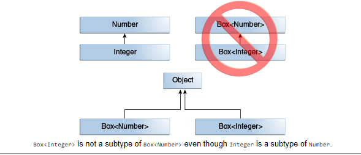
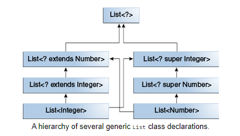
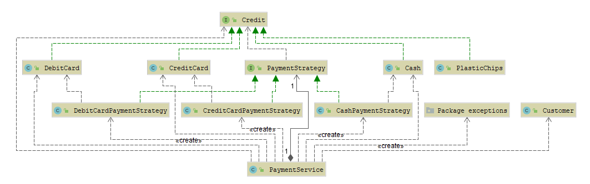

# Generics <T>

# Inhaltsverzeichnis #
[1. Naming Convention ](#1-naming-convention) 
[2. Generics, Inheritance and Subtypes ](#2-generics-inheritance-and-subtypes) 
[3. Wildcards and Subtyping](#3-wildcards-and-subtyping) 
[4. Strategy Pattern](#4-strategy-pattern) 

# 1. Naming Convention #
Type Parameter Naming Conventions
By convention, type parameter names are single, uppercase letters. This stands in sharp contrast to the variable naming conventions that you already know about, and with good reason: Without this convention, it would be difficult to tell the difference between a type variable and an ordinary class or interface name.

The most commonly used type parameter names are:

* E - Element (used extensively by the Java Collections Framework)
* K - Key
* N - Number
* T - Type
* V - Value
* S,U,V etc. - 2nd, 3rd, 4th types

# 2. Generics, Inheritance, and Subtypes #

  
# 3. Wildcards and Subtyping #

# 4. Strategy Pattern UML#
